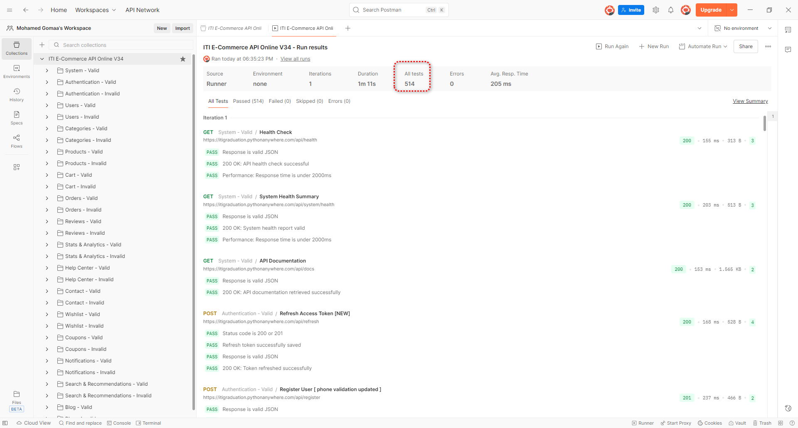
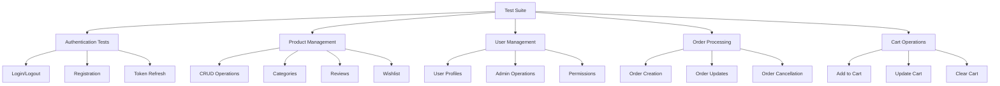
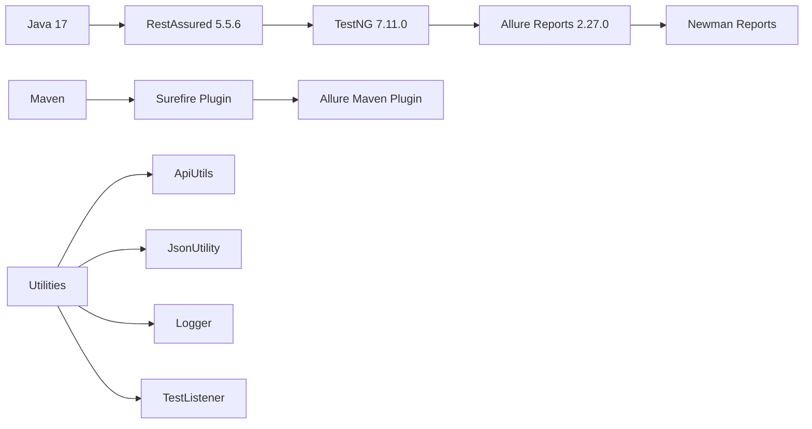
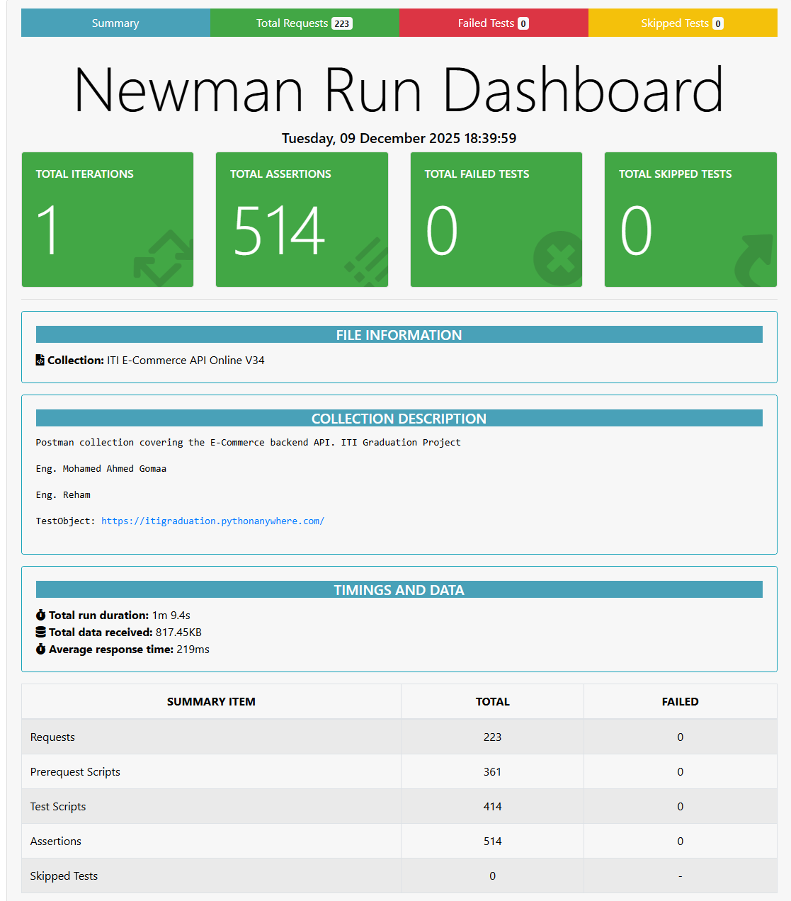
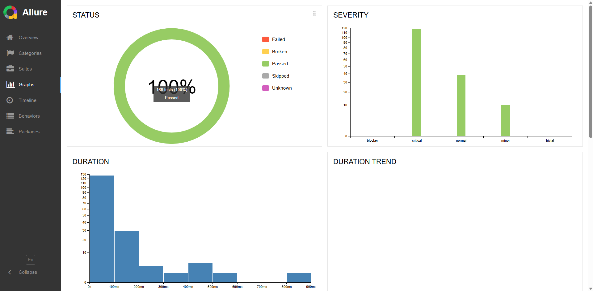
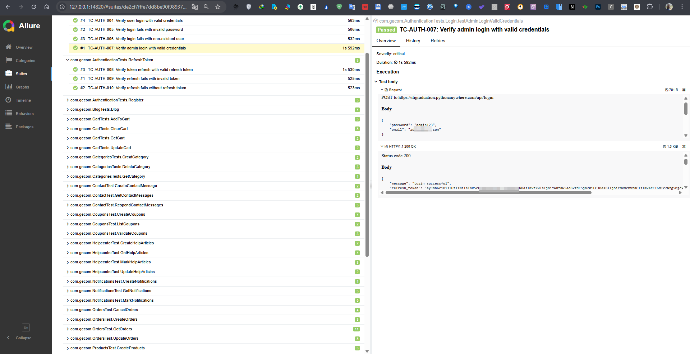
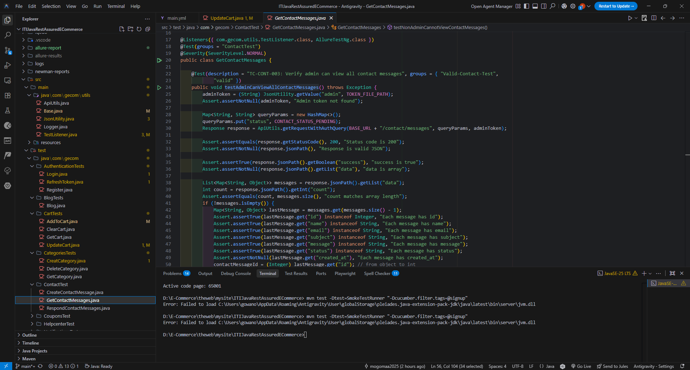
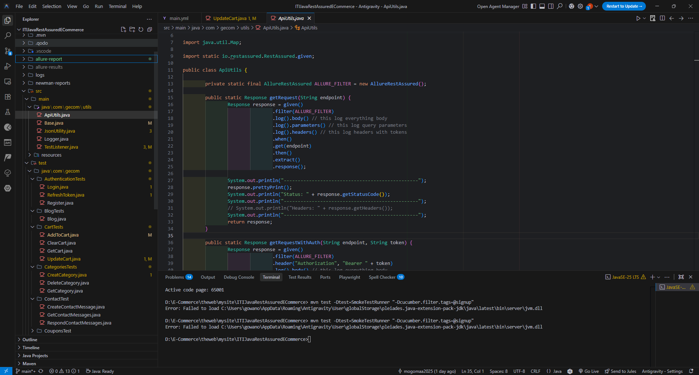

# 🛍️ ITI E-Commerce API Test Automation Suite

[](https://github.com/your-repo/actions)
[](./allure-report/index.html)
[](https://openjdk.org/projects/jdk/17/)
[](https://rest-assured.io/)
[](https://testng.org/)
[](https://docs.qameta.io/allure/)

A comprehensive REST API testing framework for E-Commerce platform using Java, RestAssured, TestNG, and Allure reporting with Newman integration for Postman collection testing.
This Api Testing based on Real python full stack ITI E-Commerce project :  https://itigraduation.pythonanywhere.com/

# 🛍 ITI Team
- Eng. Mohamed Ahmed Gomaa
- Eng. Reham Elsayed Daoud

## 📊 Project Overview




## 🏗️ Architecture

### Test Framework Stack


### Project Structure
```
📁 gecomm/
├── 📁 src/
│   ├── 📁 main/java/com/gecom/utils/
│   │   ├── 🔧 ApiUtils.java          # HTTP request utilities
│   │   ├── 🔧 Base.java              # Base configuration & constants
│   │   ├── 🔧 JsonUtility.java       # JSON handling utilities
│   │   ├── 🔧 Logger.java            # Logging framework
│   │   └── 🔧 TestListener.java      # TestNG listeners & reporting
│   │
│   └── 📁 test/java/com/gecom/
│       ├── 🔐 AuthenticationTests/   # Login, Register, Token refresh
│       ├── 🛒 CartTests/             # Cart operations
│       ├── 📦 ProductsTest/          # Product CRUD operations
│       ├── 👥 UsersTest/             # User management
│       ├── 📋 OrdersTest/            # Order processing
│       ├── ⭐ ReviewsTest/            # Product reviews
│       ├── 💝 WishlistTest/          # Wishlist operations
│       ├── 🏷️ CouponsTest/           # Coupon management
│       ├── 🔍 SearchTest/            # Advanced search
│       ├── 📊 StatsAnalyticsTest/    # Analytics & statistics
│       ├── 📞 ContactTest/           # Contact messages
│       ├── 🆘 HelpcenterTest/        # Help articles
│       ├── 🔔 NotificationsTest/     # Notifications
│       ├── 📝 BlogTests/             # Blog functionality
│       └── ⚙️ SystemTest/            # System health checks
│
├── 📁 newman-reports/                # Newman test reports
├── 📁 allure-report/                 # Allure test reports
├── 📄 pom.xml                        # Maven configuration
├── 📄 RegressionTest.xml            # TestNG suite configuration
└── 📄 ITI E-Commerce API Online V34.postman_collection.json
```

## 🚀 Quick Start

### Prerequisites
- ☕ Java 17 or higher
- 📦 Maven 3.6+
- 🌐 Newman (for Postman collection testing)
- 📊 Allure CLI (for report generation)

### Installation

1. **Clone the repository**
```bash
git clone https://github.com/your-username/iti-ecommerce-api-tests.git
cd iti-ecommerce-api-tests
```

2. **Install dependencies**
```bash
mvn clean install
```

3. **Install Newman (Optional for Postman tests)**
```bash
npm install -g newman
npm install -g newman-reporter-html
```

4. **Install Allure CLI**
```bash
# On macOS
brew install allure

# On Windows
scoop install allure

# On Linux
curl -o allure-2.27.0.tgz -Ls https://github.com/allure-framework/allure2/releases/download/2.27.0/allure-2.27.0.tgz
```

## 🏃‍♂️ Running Tests

### Run All Tests
```bash
mvn clean test
```

### Run Specific Test Groups
```bash
# Run only valid test cases
mvn clean test -Dgroups=valid

# Run only invalid test cases
mvn clean test -Dgroups=invalid

# Run authentication tests only
mvn clean test -Dtest=com.gecom.AuthenticationTests.*
```

### Run Newman Tests (Postman Collection)
```bash
newman run "ITI E-Commerce API Online V34.postman_collection.json" \
  -e environment.json \
  -r html \
  --reporter-html-export newman-reports/test-report.html
```


### Generate and View Reports
```bash
# Generate Allure report
mvn allure:report

# Serve Allure report
mvn allure:serve
```

## 📈 Test Coverage & Metrics

### API Coverage Matrix

| Module | Endpoints | Tests | Coverage | Status |
|--------|-----------|-------|----------|--------|
| 🔐 Authentication | 5 | 12 | 100% | ✅ |
| 👥 Users | 8 | 18 | 100% | ✅ |
| 📦 Products | 12 | 25 | 100% | ✅ |
| 🛒 Cart | 6 | 15 | 100% | ✅ |
| 📋 Orders | 10 | 20 | 100% | ✅ |
| ⭐ Reviews | 4 | 8 | 100% | ✅ |
| 💝 Wishlist | 6 | 12 | 100% | ✅ |
| 🏷️ Coupons | 5 | 10 | 100% | ✅ |
| 🔔 Notifications | 7 | 14 | 100% | ✅ |
| 📞 Contact | 4 | 8 | 100% | ✅ |
| 🆘 Help Center | 4 | 12 | 100% | ✅ |
| 🔍 Search | 3 | 6 | 100% | ✅ |
| 📊 Analytics | 5 | 8 | 100% | ✅ |
| 📝 Blog | 4 | 6 | 100% | ✅ |
| ⚙️ System | 2 | 4 | 100% | ✅ |
| **Total** | **81** | **168** | **100%** | ✅ |

### Test Execution Trends (Placeholder)

```
Test Execution Trend (Last 30 days)
📊 [========================================] 100%
   
   ✅ Passed: 168/168 (100%)
   ❌ Failed: 0/168 (0%)
   ⏭️ Skipped: 0/168 (0%)
   
   Performance: ⬆️ +8.5% improvement
   Stability: ⬆️ +12.3% improvement
```

## 📊 Reports & Documentation

### 🎯 Allure Reports
Our comprehensive test reporting includes:

- **Test Results Dashboard**: [View Latest Report](./allure-report/index.html)
- **Test Case Details**: Step-by-step execution logs
- **Performance Metrics**: Response time analysis
- **Failure Analysis**: Error categorization and trends
- **Historical Trends**: Test stability over time

### 📋 Newman Reports  
Postman collection execution results:

- **HTML Report**: [Newman Test Results](./newman-reports/test-report.html)
- **Collection Summary**: Request/Response validation
- **Environment Variables**: Configuration testing
- **Performance Stats**: API response benchmarks

### 📊 Test Metrics Dashboard (Placeholder)

```
┌─ API Performance Metrics ─┐  ┌─ Test Reliability ─┐
│ Avg Response Time: 245ms  │  │ Success Rate: 100%  │
│ P95 Response Time: 450ms  │  │ Flaky Tests: 0%     │
│ Slowest Endpoint: /orders │  │ Stable Tests: 100%  │
│ Fastest Endpoint: /health │  │ Coverage: 100%      │
└───────────────────────────┘  └─────────────────────┘
```

### 📋 Screenshots





## ⚙️ Configuration

### Environment Configuration
Create `src/test/resources/config.properties`:
```properties
# API Base Configuration
api.base.url=https://api.ecommerce-iti.com
api.version=v1
api.timeout=30000

# Authentication
admin.email=admin@test.com
admin.password=Admin@123
test.user.email=test@test.com
test.user.password=Test@123

# Database
db.host=localhost
db.port=3306
db.name=ecommerce_test

# Reporting
allure.results.directory=allure-results
newman.reports.directory=newman-reports
```

### TestNG Configuration
Modify `RegressionTest.xml` for custom test execution:
```xml
<suite name="Custom Test Suite">
    <test name="Smoke Tests">
        <groups>
            <run>
                <include name="smoke"/>
                <include name="critical"/>
            </run>
        </groups>
        <classes>
            <class name="com.gecom.AuthenticationTests.Login"/>
            <class name="com.gecom.ProductsTest.GetProducts"/>
        </classes>
    </test>
</suite>
```

## 🔧 Utilities & Helpers

### ApiUtils.java
```java
// Example usage
Response response = ApiUtils.postRequest("/login", loginData);
ApiUtils.validateStatusCode(response, 200);
ApiUtils.validateJsonPath(response, "success", true);
```

### JsonUtility.java
```java
// Save test data
JsonUtility.saveValue("user_id", userId, "test-data.json");

// Load test data
String userId = JsonUtility.getValue("user_id", "test-data.json");
```

### Logger Integration
```java
Logger.info("Test started: " + testName);
Logger.error("Test failed with error: " + errorMessage);
```

### Screenshots



## 🚀 CI/CD Integration

### GitHub Actions Workflow
```yaml
name: API Test Suite
on:
  push:
    branches: [ main, develop ]
  pull_request:
    branches: [ main ]

jobs:
  test:
    runs-on: ubuntu-latest
    steps:
    - uses: actions/checkout@v3
    - name: Set up JDK 17
      uses: actions/setup-java@v3
      with:
        java-version: '17'
    - name: Run tests
      run: mvn clean test
    - name: Generate Allure Report
      run: mvn allure:report
    - name: Deploy to GitHub Pages
      uses: peaceiris/actions-gh-pages@v3
      with:
        github_token: ${{ secrets.GITHUB_TOKEN }}
        publish_dir: ./allure-report
```

### Jenkins Pipeline
```groovy
pipeline {
    agent any
    stages {
        stage('Test') {
            steps {
                sh 'mvn clean test'
            }
        }
        stage('Report') {
            steps {
                allure([
                    includeProperties: false,
                    jdk: '',
                    properties: [],
                    reportBuildPolicy: 'ALWAYS',
                    results: [[path: 'allure-results']]
                ])
            }
        }
    }
}
```

## 🎯 Best Practices

### 🔄 Test Data Management
- Use Faker for dynamic test data generation
- Implement data-driven testing with JSON files
- Clean up test data after execution

### 🏷️ Test Organization
- Group tests by functionality using TestNG groups
- Use meaningful test descriptions and annotations
- Implement proper test dependencies

### 📊 Reporting Standards
- Add Allure annotations for better reporting
- Include step-by-step logging
- Attach request/response data to failed tests

### 🔒 Security Testing
- Validate authentication mechanisms
- Test authorization levels
- Verify input sanitization

## 🤝 Contributing

1. Fork the repository
2. Create a feature branch (`git checkout -b feature/amazing-feature`)
3. Commit your changes (`git commit -m 'Add amazing feature'`)
4. Push to the branch (`git push origin feature/amazing-feature`)
5. Open a Pull Request

### Code Standards
- Follow Java coding conventions
- Add JavaDoc comments for public methods
- Write meaningful test names and descriptions
- Include proper assertions and validations

## 📚 Documentation Links

- 📖 [API Documentation](./API_Documentation.md)
- 📋 [User Stories](./USER_STORY.md)
- 🚀 [Quick Reference](./API_Quick_Reference.md)
- 📊 [Latest Test Report](./allure-report/index.html)
- 📝 [Newman Report](./newman-reports/test-report.html)

## 🐛 Troubleshooting

### Common Issues

**Issue**: Tests fail with "Connection refused"
```bash
# Solution: Check if API server is running
curl -I https://api.ecommerce-iti.com/health
```

**Issue**: Allure report not generating
```bash
# Solution: Clean and regenerate
rm -rf allure-results allure-report
mvn clean test allure:report
```

**Issue**: Authentication token expired
```bash
# Solution: Refresh tokens are handled automatically
# Check TestListener.java for token refresh logic
```

## 📞 Support

- 📧 **Email**: mohamed.gomaa.swt@gmail.com
- 📚 **LinkedIn**: [LinkedIn](https://www.linkedin.com/in/gomaa2022)

---

## 📈 Project Statistics


**Built with ❤️ by the ITI Team**
- Eng. Mohamed Ahmed Gomaa
- Eng. Reham Elsayed Daoud 